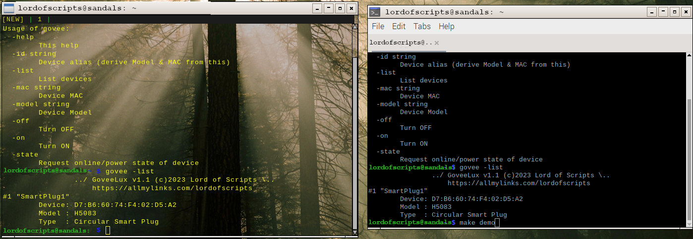

# Govee CLI User Manual



Please read this short user manual before using the application. Make sure you have your own
GOVEE API key installed. Without the API key it won't work and it is not included. .

I'm sure you will find this utility quite handy. Feel free to consider a small
donation so that I can continue working on these utilities:


|     | Show your support   |
| --- | :---: |
| [ ](https://allmylinks.com/lordofscripts)      | visit <br> Lord of Scripts&trade; <br> on [AllMyLinks.com](https://allmylinks.com/lordofscripts)                  |
| [ ](https://allmylinks.com/lordofscripts)|  buy Lord of Scripts&trade; <br> a Capuccino on <br>[BuyMeACoffee.com](https://www.buymeacoffee.com/lostinwriting)|

## Setup

First you have to download this to your local machine:

> `go get github.com/lordofscripts/govee`

Then compile the application. The resulting `govee` executable is installed in your personal GO
directory `$GOBIN`.

> `make`

Then ensure you requested your own Govee API key and that you received it per email. For the
application to work you need to install this API key either in an environment variable or in a
configuration file.  The name of the environment variable where you should store your Govee
API key is `GOVEE_API`.

If you opt for the environment variable, it would depend on which Unix/Linux shell you use. In
Linux bash I set this variable in my `~/.bashrc` file as follows:

> `export GOVEE_API="aabbccdd-dead-fee7-eeff-112233445566"`

Obviously you would substitute that with your own as this is not a real API key, and is only for
illustrative purposes.

## Local Configuration

While it is much easier to have your API key in an environment variable, I suggest storing it in
the application's configuration file. That is unless you have a gifted memory to remember all
the MAC addresses and model numbers of your local devices.

### Configuration File

The configuration file, if present, it should be in JSON format. If not present
create one with the `init` flag. This configuration file location depends on
which OS you use:

Linux
: `~/.config/goveelux.json`
Windows
: `$USERPROFILE\goveelux.json`
MacOS
: `$HOME/.goveelux.json`

It would look like this:

```json
{
	"version": "0.1",
	"apiKey": "YOUR GOVEE API KEY HERE"
	"devices": [
		{
			"model": "H5083",
			"mac": "AA:BB:CC:DD:EE:FF:00:11",
			"alias": "SmartPlug1",
			"location": "Bedroom #2"
		}
	]
}
```

The MAC address is a series of 8 hexadecimal pairs which *is unique to each
device* and looks like this: `AA:BB:CC:DD:EE:FF:00:11`

The convenience of this configuration file is that in it you can declare all your Govee smart
devices by their *device model number*, i.e. "`H5083`" and their own *MAC address*, and in the
process assign them a unique *alias* or ID (required) and an optional *physical location*.

## Usage

This CLI app knows two types of commands: Informational and Executional. The
first is to retrieve information about the app or the local GOVEE ecosystem. The
second type executes an order on a specific GOVEE device.


| Flag        | Parameter      | Description              | Requires -mac & -model <br> OR -id flag(s) |
|--------------|----------------|------------------------------------------|:--------------------------:|
| *-help*      |                | Help information                         | no   |
| *-init*      |                | Create a sample configuration file       | no   |
| *-list*      |                | List all devices in the network          | no   |
| -mac         |  *MAC address* | Device's network address                 |  N.A.|
| -model       |  *device model*| Device's model number                    |  N.A.|
| -id          | *unique_name*  |  Device alias (friendly name)            | N.A. |
| *-on*        |                | Turn on the device                       | yes  |
| *-off*       |                | Turn off the device                      | yes  |
| *-state*     |        | Request device info & state      | yes |
| *-brightness*| `0..100`       | Set brightness percentage *(lights only)*| yes  |
| *-color*     |   `aabbcc`     |  Set RGB color to #aabbcc *(lights only)*| yes  |

### Informational Commands

> `govee -help`

Displays information about all the commands and their parameters.

> `govee -list`

Uses your WiFi/Internet connection to query your local network and list ALL
**Govee** smart devices. It will list them, displaying their model number (for use
with `-model` flag), MAC address (`-mac` flag) and official name.

> `govee -init`

You will typically use this command only the first time after installing the
application. It creates a new sample configuration file that you should edit.
If there is already one present, then no action is performed (no overwrite)..

### Executional Commands

There are two forms of performing executional commands with the CLI app:

* Explicit addressing
* Friendly (Implicit) addressing

*Explicit addressing*
: With this method the user must specify both the device's *MAC address* and *model number*. These explicit executional commands take the form:

> `govee -mac {MAC_ADDRESS} -model {MODEL_NUMBER} {executable_command}`
> *Example*: `govee -mac AA:BB:CC:DD:EE:FF:00:11 -model H5083 {executable_command}`

*Friendly addressing*
: This alternative method spares the user from remembering or looking up a MAC address and model number. In this case the user only needs to remember the device's friendly name (alias). However, in order to use this, you will need to add the corresponding device entries in the configuration file. That way the app can look this `-id` up and figure out both the MAC address and model number. The implicit addressing commands take the form:

> `govee -id {ALIAS_NAME} {execution_flag}`
> *Example*: `govee -id SmartPlug1 {execution_flag}`

With this in mind, we can now explain all the executable commands this app recognizes. With
them you will be able to control your Govee devices like smart plugs and lights.

#### Execution Flags

For brevity in this section we will only show the executable command to use on the CLI as it
would substitute `{execution_flag}` in the **Explicit & Friendly Addressing** command samples
above.

> `-on`

Turns on the chosen device.

> `-off`

Turns off the chosen device.

> `-state`

Queries the current state of the chosen device. It will show information such as whether it
is online, powered on/off, etc.

> `-brightness VALUE`
> *Example*: `govee -id WallSconces -brightness 80`

This command requires an integer parameter `VALUE` representing a *brightness percentage* (0..100). It is only functional if the chosen device is a Govee light/LED device.

> `-color RGB_VALUE`
> *Example*: `govee -id WallSconces -color FFA512`
> *Example*: `govee -id WallSconces -color FA3`
> *Example*: `govee -id WallSconces -color "#FFA512"`

This command requires a hexadecimal string parameter `RGB_VALUE` representing an
*RGB color* (0..100). It is only functional if the chosen device is a Govee light/LED device.

The given RGB string represents the Red/Green/Blue triad that will be applied to all lights of the
chosen device. This value, if specified with the # prefix, must be enclosed in double quotes.
However, it is easier to omit that prefix in which case the quotes can be omitted. The RGB value
can be either 3 or 6 letters long.


-----
> All Rights Reserved [LordOfScripts&trade;](https://allmylinks.com/lordofscripts)
